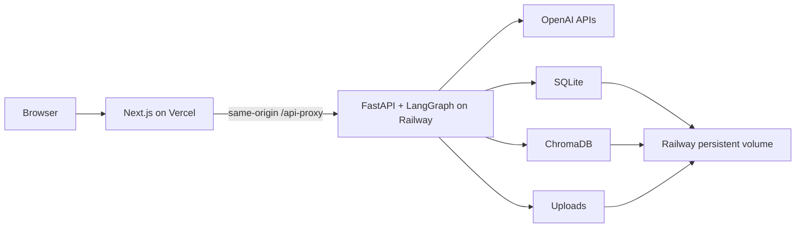

<div align="center">

# AgentSprout Studio

**Students build. Teachers evaluate. Safe agents get published.**

[](https://agentsprout.vercel.app/p/ocean-explorer)
[](https://github.com/Ian010529/AgentSprout/actions/workflows/ci.yml)
[](backend/pyproject.toml)
[](frontend/package.json)

[Public Agent](https://agentsprout.vercel.app/p/ocean-explorer) ·
[Protected Studio](https://agentsprout.vercel.app/access) ·
[Cloud evidence](docs/evidence/M8_CLOUD_ACCEPTANCE.md)

</div>

AgentSprout is a deployed full-stack concept for building child-safe, knowledge-grounded AI
agents. A student defines and tests an Agent, a teacher evaluates the immutable version against
16 fixed cases, and only an approved version can be published.

> [!NOTE]
> This is an independent interview project inspired by public AI-education needs. It is not
> affiliated with or endorsed by Bytewise Coding and uses no private company materials.

## What it demonstrates

- **Real RAG:** PDF ingestion, page-aware chunking, OpenAI embeddings, Chroma retrieval, and validated citations.
- **Safety before generation:** PII is blocked before provider calls or raw persistence; homework, injection, moderation, and knowledge-boundary routes are explicit.
- **Agent evaluation:** 16 persisted cases combine deterministic checks with a structured Teacher Judge and release thresholds.
- **Product lifecycle:** Draft → immutable review → requested changes/v2 comparison → approval → public release/withdrawal.
- **Observable model-development workflow:** pinned models, sanitized traces, latency, token usage, cost estimates, retries, and failure evidence.
- **Production-shaped delivery:** responsive UI, accessibility checks, Docker, CI, HTTPS deployment, persistent storage, reset, and restart verification.

## Architecture



The same-origin proxy keeps Studio cookies first-party while Railway still enforces Origin,
CSRF, role, and session checks. The demo intentionally uses one backend replica and one volume.

## Five-minute interview flow

1. Create **Ocean Explorer** and upload NOAA's public-domain *Ocean Literacy* PDF.
2. Ask a normal question and open its page-level citations.
3. Show privacy blocking, guided homework help, and prompt-injection resistance.
4. Submit the immutable version and run the 16-case Teacher evaluation.
5. Inspect a failure, model usage, trace evidence, and the release gate.
6. Approve, publish, and open the responsive public Agent.

## Acceptance snapshot

| Check | Production result |
|---|---:|
| Real cloud lifecycle | 2 min 44.6 sec |
| Reset-to-publish rehearsal | 1 min 28.8 sec |
| Teacher evaluation | 16/16 completed, 15 passed, 0 errors, release eligible |
| Post-restart RAG | 7.5 sec, 4 validated citations |
| Browser accessibility | 0 axe violations in desktop Chromium and 375 px WebKit |
| Persistence | SQLite, Chroma, upload, evaluation, and publication survived restart |

Full measurements, models, usage, and deployment IDs are recorded in the
[cloud acceptance report](docs/evidence/M8_CLOUD_ACCEPTANCE.md).

## Stack

| Layer | Technology |
|---|---|
| Frontend | Next.js 16, React 19, TypeScript, assistant-ui |
| Backend | Python 3.12, FastAPI, typed LangGraph runtime |
| Models | `gpt-4o-mini`, `gpt-4.1-mini`, `text-embedding-3-small`, Moderation API |
| Data | SQLite, embedded persistent ChromaDB, local-volume uploads |
| Delivery | Docker, GitHub Actions, Vercel, Railway |

## Quick start

Requirements: Python 3.12, Node 24, pnpm 11.9, and an OpenAI API key.

```bash
git clone https://github.com/Ian010529/AgentSprout.git
cd AgentSprout

python3.12 -m venv backend/.venv
backend/.venv/bin/python -m pip install --upgrade "pip==25.3"
backend/.venv/bin/python -m pip install -r backend/requirements.lock
backend/.venv/bin/python -m pip install -e backend --no-deps

cd frontend && pnpm install --frozen-lockfile && cd ..
cp .env.example .env
backend/.venv/bin/python scripts/download_noaa_source.py
cd backend && .venv/bin/alembic upgrade head && cd ..
```

Replace every placeholder in `.env`, then start the two processes:

```bash
# Terminal 1
cd backend && .venv/bin/uvicorn app.main:create_app --factory --reload --port 8000

# Terminal 2
cd frontend && pnpm dev
```

Open <http://localhost:3000>. Runtime deliberately fails clearly when required secrets or the
configured OpenAI models are unavailable; there is no fake/offline model fallback.

## Verification

```bash
cd backend && .venv/bin/ruff check app tests alembic && .venv/bin/pyright && .venv/bin/pytest
cd ../frontend && pnpm lint && pnpm typecheck && pnpm test && pnpm build
```

CI additionally runs the complete provider-boundary browser lifecycle, WebKit mobile checks,
axe, empty migrations, Git-history secret/runtime scans, Docker build, and volume restart.

## Documentation

- [Architecture](docs/ARCHITECTURE.md) and [API contracts](docs/API_CONTRACTS.md)
- [Safety and privacy](docs/SECURITY_AND_PRIVACY.md)
- [Evaluation suite](docs/EVALUATION_SUITE.md) and [test strategy](docs/TEST_STRATEGY.md)
- [Deployment plan](docs/DEPLOYMENT.md) and [demo runbook](docs/DEMO_RUNBOOK.md)
- [Cloud acceptance evidence](docs/evidence/M8_CLOUD_ACCEPTANCE.md)

## Scope and limitations

This is a supervised concept MVP, not a production child service. It does not provide child
accounts, parental consent, school identity, distributed jobs, managed multi-replica storage,
incident operations, or legal/safeguarding approval. Public chat content is memory-only and
rate-limited; Studio content follows the documented retention policy. Public metadata may remain
cached for up to 60 seconds after withdrawal.

The demo source is NOAA's unchanged, checksum-verified 2024 *Ocean Literacy* PDF, identified by
NOAA as CC0 Public Domain. See [source and attribution details](docs/KNOWLEDGE_SOURCE.md).
