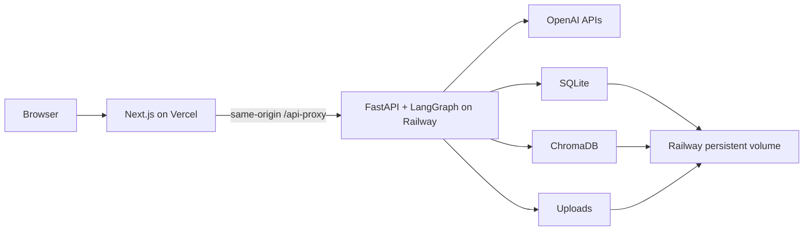

<div align="center">

# AgentSprout Studio

**Build, evaluate, and publish knowledge-grounded learning Agents.**

[English](README.md) | [简体中文](README.zh-CN.md)

[](https://agentsprout.vercel.app)
[](https://github.com/Ian010529/AgentSprout/actions/workflows/ci.yml)
[](backend/pyproject.toml)
[](frontend/package.json)

[Public Agent](https://agentsprout.vercel.app/p/ocean-explorer) ·
[Protected Studio](https://agentsprout.vercel.app/access) ·
[Acceptance evidence](docs/evidence/M9_TASK_FIRST_UX_ACCEPTANCE.md)

</div>

AgentSprout is a full-stack prototype for creating supervised, child-facing AI learning Agents.
A student configures and tests an Agent against a trusted knowledge source. A teacher evaluates an
immutable version against a fixed suite before approving and publishing it.

## Capabilities

- **Grounded retrieval:** PDF ingestion, page-aware chunking, OpenAI embeddings, Chroma retrieval,
  evidence thresholds, and validated page-level citations.
- **Pre-provider privacy checks:** common PII is blocked before model calls and before raw input can
  be persisted.
- **Explicit safety paths:** homework assistance, prompt injection, moderation, and out-of-source
  questions follow separate, testable runtime branches.
- **Versioned review lifecycle:** Draft, immutable submission, requested changes, version comparison,
  approval, publication, and withdrawal.
- **Persisted evaluation:** 16 fixed cases combine deterministic checks with a structured model Judge
  and server-computed release criteria.
- **Operational evidence:** sanitized traces, model identifiers, latency, token usage, estimated cost,
  retries, and individual failure records are available to the Teacher view.
- **Responsive public use:** the published Agent provides a chat-first interface, citations, privacy
  reminders, rate-limit states, and mobile support from 375 px.

## Architecture



The same-origin proxy keeps Studio session cookies first-party. The backend enforces Origin, CSRF,
role, and session checks and stores SQLite, Chroma, and uploaded sources on one persistent volume.
The current deployment uses a single backend replica.

## Product workflow

1. Create an Agent and define its learner need, users, age range, goal, tone, and behavior.
2. Upload a supported PDF and wait for extraction, chunking, embedding, and indexing.
3. Test grounded questions and safety boundaries in the private Studio playground.
4. Submit an immutable version for Teacher review.
5. Run the fixed evaluation suite and inspect metrics, failed cases, traces, and model usage.
6. Request a revised version or approve and publish the evaluated version.
7. Use the published Agent through its responsive public URL, or withdraw it from the Studio.

## Technology

| Layer | Technology |
|---|---|
| Frontend | Next.js 16, React 19, TypeScript, assistant-ui |
| Backend | Python 3.12, FastAPI, typed LangGraph runtime |
| Models | `gpt-4o-mini`, `gpt-4.1-mini`, `text-embedding-3-small`, Moderation API |
| Data | SQLite, embedded persistent ChromaDB, volume-backed uploads |
| Delivery | Docker, GitHub Actions, Vercel, Railway |

## Quick start

Requirements: Python 3.12, Node.js 24, pnpm 11.9, and an OpenAI API key.

```bash
git clone https://github.com/Ian010529/AgentSprout.git
cd AgentSprout

python3.12 -m venv backend/.venv
backend/.venv/bin/python -m pip install --upgrade "pip==25.3"
backend/.venv/bin/python -m pip install -r backend/requirements.lock
backend/.venv/bin/python -m pip install -e backend --no-deps

cd frontend && pnpm install --frozen-lockfile && cd ..
cp .env.example .env
backend/.venv/bin/python scripts/download_noaa_source.py
cd backend && .venv/bin/alembic upgrade head && cd ..
```

Replace every placeholder in `.env`, then start the backend and frontend separately:

```bash
# Terminal 1
cd backend && .venv/bin/uvicorn app.main:create_app --factory --reload --port 8000

# Terminal 2
cd frontend && pnpm dev
```

Open <http://localhost:3000>. The runtime reports missing secrets or unavailable configured models
as errors; it does not include an offline or canned-answer model fallback.

## Verification

```bash
cd backend && .venv/bin/ruff check app tests alembic && .venv/bin/pyright && .venv/bin/pytest
cd ../frontend && pnpm lint && pnpm typecheck && pnpm test && pnpm build
```

CI also verifies empty-database migrations, the complete provider-boundary browser lifecycle,
375 px WebKit behavior, axe accessibility, repository secret/runtime-data boundaries, the Docker
image, and persistence across a container restart. Recorded results are available in the
[acceptance evidence](docs/evidence/M9_TASK_FIRST_UX_ACCEPTANCE.md).

## Documentation

- [Product requirements](docs/PRD.md) and [UX specification](docs/UX_SPEC.md)
- [Architecture](docs/ARCHITECTURE.md) and [API contracts](docs/API_CONTRACTS.md)
- [Safety and privacy](docs/SECURITY_AND_PRIVACY.md)
- [Evaluation suite](docs/EVALUATION_SUITE.md) and [test strategy](docs/TEST_STRATEGY.md)
- [Deployment](docs/DEPLOYMENT.md) and [knowledge-source attribution](docs/KNOWLEDGE_SOURCE.md)

## Scope and limitations

AgentSprout is a supervised prototype, not an approved production service for unsupervised child
use. It does not provide child accounts, parental consent, school identity integration, distributed
task execution, managed multi-replica storage, incident operations, or legal and safeguarding approval.

Public chat content is held in process memory for a limited period and is rate-limited. Studio data
follows the documented retention policy. Public metadata may remain cached for up to 60 seconds
after withdrawal. The included example uses NOAA's unchanged, checksum-verified 2024 *Ocean
Literacy* PDF, which NOAA identifies as CC0 Public Domain.
