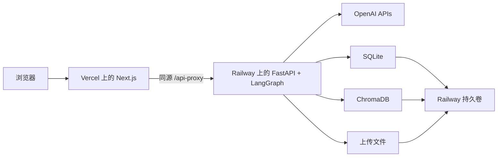

<div align="center">

# AgentSprout Studio

**构建、评测并发布基于可信知识的学习型 Agent。**

[English](README.md) | [简体中文](README.zh-CN.md)

[](https://agentsprout.vercel.app)
[](https://github.com/Ian010529/AgentSprout/actions/workflows/ci.yml)
[](backend/pyproject.toml)
[](frontend/package.json)

[公开 Agent](https://agentsprout.vercel.app/p/ocean-explorer) ·
[受保护的 Studio](https://agentsprout.vercel.app/access) ·
[验收记录](docs/evidence/M9_TASK_FIRST_UX_ACCEPTANCE.md)

</div>

AgentSprout 是一个用于创建受监督、面向儿童的 AI 学习型 Agent 的全栈原型。学生可以基于
可信知识源配置和测试 Agent；教师则通过固定评测套件检查不可变版本，并决定是否批准和发布。

## 功能

- **基于证据的检索：** PDF 摄取、按页分块、OpenAI 向量嵌入、Chroma 检索、证据阈值和经过
  校验的页级引用。
- **模型调用前的隐私检查：** 常见个人身份信息会在调用模型和持久化原始输入之前被拦截。
- **明确的安全路径：** 作业辅导、提示注入、内容审核和知识范围外问题分别进入可测试的运行分支。
- **版本化审核流程：** 支持草稿、不可变提交、修改请求、版本比较、批准、发布和撤回。
- **持久化评测：** 16 个固定案例结合确定性检查、结构化模型 Judge 和由服务器计算的发布条件。
- **运行证据：** 教师界面提供脱敏轨迹、模型标识、延迟、Token 使用量、成本估算、重试和单项
  失败记录。
- **响应式公开使用：** 已发布 Agent 提供聊天优先界面、引用、隐私提醒、限流状态，并支持从
  375 px 起的移动端布局。

## 架构



同源代理使 Studio 会话 Cookie 保持为第一方 Cookie。后端执行 Origin、CSRF、角色和会话检查，
并将 SQLite、Chroma 和上传的知识文件保存在同一个持久卷中。当前部署使用单个后端副本。

## 产品流程

1. 创建 Agent，定义学习需求、目标用户、年龄范围、目标、语气和行为。
2. 上传支持的 PDF，等待文本提取、分块、向量化和索引完成。
3. 在私有 Studio Playground 中测试知识问答和安全边界。
4. 提交不可变版本，进入教师审核。
5. 运行固定评测套件，查看指标、失败案例、运行轨迹和模型用量。
6. 要求创建修订版本，或批准并发布已评测版本。
7. 通过公开 URL 使用已发布 Agent，或在 Studio 中将其撤回。

## 技术栈

| 层级 | 技术 |
|---|---|
| 前端 | Next.js 16、React 19、TypeScript、assistant-ui |
| 后端 | Python 3.12、FastAPI、类型化 LangGraph 运行时 |
| 模型 | `gpt-4o-mini`、`gpt-4.1-mini`、`text-embedding-3-small`、Moderation API |
| 数据 | SQLite、嵌入式持久化 ChromaDB、持久卷上传目录 |
| 交付 | Docker、GitHub Actions、Vercel、Railway |

## 本地启动

环境要求：Python 3.12、Node.js 24、pnpm 11.9 和 OpenAI API Key。

```bash
git clone https://github.com/Ian010529/AgentSprout.git
cd AgentSprout

python3.12 -m venv backend/.venv
backend/.venv/bin/python -m pip install --upgrade "pip==25.3"
backend/.venv/bin/python -m pip install -r backend/requirements.lock
backend/.venv/bin/python -m pip install -e backend --no-deps

cd frontend && pnpm install --frozen-lockfile && cd ..
cp .env.example .env
backend/.venv/bin/python scripts/download_noaa_source.py
cd backend && .venv/bin/alembic upgrade head && cd ..
```

替换 `.env` 中的全部占位符，然后分别启动后端和前端：

```bash
# 终端 1
cd backend && .venv/bin/uvicorn app.main:create_app --factory --reload --port 8000

# 终端 2
cd frontend && pnpm dev
```

访问 <http://localhost:3000>。缺少必要密钥或配置的模型不可用时，运行时会明确返回错误；项目不包含
离线模型或预设答案回退。

## 验证

```bash
cd backend && .venv/bin/ruff check app tests alembic && .venv/bin/pyright && .venv/bin/pytest
cd ../frontend && pnpm lint && pnpm typecheck && pnpm test && pnpm build
```

CI 还会验证空数据库迁移、完整的 provider-boundary 浏览器流程、375 px WebKit、axe 无障碍、仓库
密钥和运行数据边界、Docker 镜像，以及容器重启后的数据持久性。结果记录在
[验收证据](docs/evidence/M9_TASK_FIRST_UX_ACCEPTANCE.md)中。

## 文档

- [产品需求](docs/PRD.md)和[界面规范](docs/UX_SPEC.md)
- [系统架构](docs/ARCHITECTURE.md)和[API 合约](docs/API_CONTRACTS.md)
- [安全与隐私](docs/SECURITY_AND_PRIVACY.md)
- [评测套件](docs/EVALUATION_SUITE.md)和[测试策略](docs/TEST_STRATEGY.md)
- [部署说明](docs/DEPLOYMENT.md)和[知识源归属](docs/KNOWLEDGE_SOURCE.md)

## 范围与限制

AgentSprout 是一个受监督的产品原型，并非已获批准、可供儿童独立使用的生产服务。它不包含儿童
账户、家长同意、学校身份系统、分布式任务、托管多副本存储、事件响应体系或法律与儿童保护审批。

公开聊天内容只会在进程内存中保留有限时间，并受到访问频率限制。Studio 数据遵循项目记录的保留
策略。Agent 被撤回后，公开元数据最多可能继续缓存 60 秒。示例使用 NOAA 未经修改且经过校验和
验证的 2024 年 *Ocean Literacy* PDF；NOAA 将其标记为 CC0 Public Domain。
