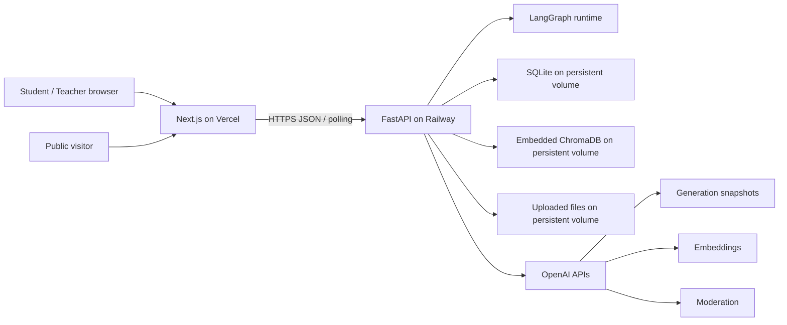
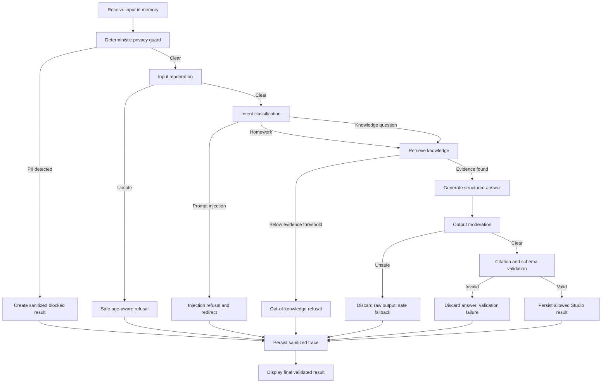

# Architecture

## 1. Architecture goals

- Deliver a reproducible interview demo with real model, retrieval, safety, evaluation, and publishing behavior.
- Keep local development simple while preserving a credible cloud architecture.
- Make every long-running operation observable and resumable from persisted status.
- Keep child-facing content behind deterministic privacy checks and output validation.
- Avoid infrastructure that is not justified by the single-workspace MVP.

## 2. System context



## 3. Deployment topology

### Vercel

- Hosts the Next.js application.
- Contains no OpenAI, Studio access, admin reset, or session secrets.
- Receives only `NEXT_PUBLIC_API_BASE_URL`.
- Calls the Railway API over HTTPS.

### Railway

- Runs one FastAPI backend instance from a Dockerfile.
- Mounts one persistent volume at `/app/data`.
- Stores secrets as Railway environment variables.
- Must not scale beyond one replica while using SQLite and embedded Chroma.
- Exposes `/health` and `/ready` for platform checks.

### Persistent volume layout

```text
/app/data/
├── app.db
├── chroma/
└── uploads/
    └── {agent_id}/{version_id}/{document_id}/source.{ext}
```

Local development uses the same relative layout under a configurable project data directory. Runtime data is gitignored.

## 4. Planned technology boundaries

### Frontend

- Next.js with TypeScript and React.
- assistant-ui components are reused selectively for conversation primitives.
- Do not fork a full agent-chat repository.
- The stable `frontend/src/lib/api.ts` entry point re-exports API contract types and the system,
  Studio, and public clients. Its internal modules separate type-only contracts, shared transport
  and safe-error normalization, and each endpoint group. Endpoint modules may depend on transport
  and contract types; transport may depend on contract types; neither lower layer depends on an
  endpoint module or React component.
- The typed API client owns transport, error normalization, CSRF headers, and polling.
- Server state comes from the API; no duplicate client-side source of truth for lifecycle or job state.

### Backend

- FastAPI for HTTP contracts and validation.
- Pydantic application contracts and application errors are owned outside the HTTP package.
  `app.api.schemas` and `app.api.errors` are compatibility/adaptation surfaces only. Routes may
  depend on services and contracts; services must not depend on `app.api`.
- Service modules own feature commands/workflows. Pure shared safety policy, shared model-call
  quota enforcement, Chat read projections, and vector infrastructure identifiers have neutral
  modules rather than being imported from another feature's implementation.
- Pydantic provides request, response, and application boundary schemas.
- SQLAlchemy and Alembic for SQLite persistence and schema evolution.
- SQLite WAL mode with foreign keys enabled.
- LangGraph for the chat/safety state machine.
- ChromaDB persistent embedded client for vector storage.
- Official OpenAI Python SDK for Responses, Embeddings, and Moderation APIs.

Exact dependency versions are selected and locked in M1. Do not add an abstraction framework unless a current module requires it.

## 5. Configuration contract

Required secrets:

| Variable | Local | Railway | Browser |
|---|---:|---:|---:|
| `OPENAI_API_KEY` | yes | yes | never |
| `STUDIO_ACCESS_CODE` | yes | yes | never |
| `ADMIN_RESET_TOKEN` | yes | yes | never |
| `SESSION_SECRET` | yes | yes | never |

Required non-secret runtime configuration:

| Variable | Planned default |
|---|---|
| `APP_ENV` | `development` locally |
| `DATA_DIR` | `./data` locally, `/app/data` on Railway |
| `ALLOWED_ORIGINS` | local frontend origin; production Vercel origin |
| `ONLINE_MODEL` | `gpt-4o-mini-2024-07-18` |
| `JUDGE_MODEL` | `gpt-4.1-mini-2025-04-14` |
| `EMBEDDING_MODEL` | `text-embedding-3-small` |
| `MODERATION_MODEL` | `omni-moderation-latest` |
| `RAG_TOP_K` | `4` |
| `RAG_MIN_SIMILARITY` | initial `0.35`, calibrated only through M4 evaluation |
| `OPENAI_TIMEOUT_SECONDS` | `20` |
| `OPENAI_MAX_RETRIES` | `2` |
| `STUDIO_RETENTION_DAYS` | `30` |
| `PUBLIC_HOURLY_LIMIT` | `10` |
| `PUBLIC_DAILY_LIMIT` | `20` |
| `STUDIO_HOURLY_LIMIT` | `60` |
| `GLOBAL_DAILY_MODEL_LIMIT` | `300` |
| `DAILY_EVALUATION_LIMIT` | `5` |
| `DAILY_INGESTION_LIMIT` | `5` |

Startup fails clearly if required secrets, data paths, or model IDs are missing. There is no silent fallback model.

## 6. LangGraph runtime



### Node rules

- Privacy detection is deterministic and runs synchronously before raw input persistence or any provider call.
- Moderation runs on allowed input and on complete generated output.
- Intent classification returns a strict structured enum.
- Retrieval filters by exact agent version and active document.
- Low retrieval confidence branches without generation.
- Generation returns structured answer text and cited chunk IDs.
- Citation validation rejects unknown, non-retrieved, duplicate-only, or empty citations.
- Raw unsafe or invalid model output is discarded and never displayed or stored.
- No model token is streamed to the browser.

### Run phases exposed to UI

The persisted phase enum is:

```text
QUEUED
PRIVACY_CHECK
MODERATION
INTENT_CLASSIFICATION
RETRIEVAL
GENERATION
OUTPUT_VALIDATION
COMPLETED
FAILED
```

The frontend maps these phases to approved user-facing copy. It does not advance phases locally.

## 7. Retrieval architecture

### Ingestion

1. Validate MIME type, extension, size, and Draft ownership.
2. Compute SHA-256.
3. Stage the file without replacing the active document.
4. Extract text with page boundaries.
5. Reject encrypted, scanned/effectively empty, corrupted, or over-100-page PDFs.
6. Normalize whitespace without rewriting content.
7. Chunk with paragraph-aware boundaries; initial target approximately 700 characters with 120-character overlap.
8. Batch OpenAI embedding requests.
9. Upsert chunks into the single Chroma collection with stable IDs.
10. Atomically mark the staged document active and retire the prior Draft document.

If a step fails, the prior active document remains usable and staged vectors/files are cleaned or marked for idempotent cleanup.

### Chroma collection

Use one collection named `knowledge_chunks`. Required metadata:

- `agent_id`
- `version_id`
- `document_id`
- `filename`
- `page_number` where applicable
- `chunk_index`
- `text_sha256`
- `embedding_model`

Stable chunk ID format is derived from document SHA-256, page, chunk index, and normalized text checksum. The application owns one thin `VectorStore` boundary with only a Chroma implementation in the MVP.

### Query

- Embed the query using the configured embedding model.
- Filter by `version_id` and active `document_id`.
- Retrieve top four by cosine similarity.
- Require at least one result at or above the configured threshold.
- Pass only retrieved excerpts and stable chunk IDs to generation.
- Do not expose Chroma internals or raw distance values to public users.

## 8. Background jobs

The MVP uses in-process asynchronous tasks with persisted job state. It does not use Celery, Redis, or a separate worker.

### Ingestion jobs

- One active ingestion per Studio workspace.
- Return `202 Accepted` immediately.
- Persist `UPLOADED`, `EXTRACTING`, `CHUNKING`, `EMBEDDING`, `READY`, or `FAILED`.
- Target completion under 90 seconds; hard timeout at three minutes.
- On backend startup, an unfinished job is marked failed with `SERVICE_RESTARTED` and may be retried.

### Evaluation jobs

- One active evaluation per agent version.
- Run at most three cases concurrently.
- Persist each case result immediately.
- Target completion under two minutes; hard timeout at five minutes.
- Refresh restores `completed_count / 16`.
- An infrastructure-failed case prevents release eligibility.

### Chat runs

- The POST endpoint performs the deterministic privacy check before accepting raw Studio input.
- A normal allowed Studio message is then persisted and processed asynchronously.
- A public prompt remains in process memory only; only sanitized run metadata is persisted.
- If the process restarts, unfinished public or Studio runs become failed and are retryable through a new run.

## 9. Model routing

| Workload | Model/API | Reason |
|---|---|---|
| online grounded answer | `gpt-4o-mini-2024-07-18` | inexpensive focused generation |
| intent classification | same online model, structured output | one runtime model and consistent behavior |
| teacher semantic judge | `gpt-4.1-mini-2025-04-14` | stronger instruction-following for rubric scoring |
| embeddings | `text-embedding-3-small` | low-cost semantic retrieval |
| content moderation | `omni-moderation-latest` | current safety classifier |

No automatic model escalation is implemented. A model change creates a new evaluation baseline.

## 10. Evaluation architecture

Each case executes the real runtime path for its version. Deterministic evaluators check:

- expected route/result type
- whether generation was incorrectly invoked
- citation IDs and page validity
- PII non-persistence canaries
- refusal/guide/block behavior
- schema integrity and infrastructure success

The Judge model scores only semantic qualities requiring judgment:

- answer support by supplied evidence
- age appropriateness, 1–5
- instruction following, 1–5

Judge input contains the rubric, sanitized case input, final displayed output, retrieved evidence, age mode, and expected behavior. It does not receive hidden secrets or unrelated conversations.

## 11. Authentication and request security

- Studio uses a shared access code to create an opaque server session.
- The session token is stored only in a Secure HttpOnly cookie.
- Cross-site production cookies use `SameSite=None; Secure`; every Studio mutation additionally requires a CSRF token.
- CORS permits only configured exact frontend origins and credentialed requests.
- Server state owns the demo role; role changes use an authenticated endpoint.
- Public endpoints do not accept Studio cookies as authority.
- Admin reset uses a distinct header secret, constant-time comparison, and no UI.
- API responses never contain secret configuration.

This is a demo gate, not production authentication. The limitation must remain visible in documentation.

## 12. Rate limiting and provider resilience

- Rate buckets persist in SQLite and use a keyed hash of normalized client IP; raw IP is not stored.
- Only trusted Railway proxy headers are used to derive client IP.
- Public, Studio, evaluation, ingestion, and global provider limits are independent.
- User input is limited to 1,000 characters.
- Generated output is capped at approximately 350 tokens and further constrained by age-mode word targets.
- Retry only network errors, `429`, and `5xx`, at most twice with exponential backoff and jitter.
- Do not retry validation errors, moderation decisions, other `4xx`, or blocking safety outcomes.
- Return a stable error code and retry information where appropriate.

## 13. Observability

Persist sanitized run evidence:

- IDs and version linkage
- start/end time and total duration
- nodes visited and per-node duration
- result category
- safety category without blocked raw PII
- retrieved chunk IDs, pages, ranks, and similarity
- model IDs and token usage
- estimated cost based on configured price metadata
- citation-validation result
- normalized error code and retry count

Student sees simplified phases and citations. Teacher sees sanitized trace. Public users see neither internal trace nor evaluation data. No LangSmith, Sentry, or third-party telemetry is included in the MVP.

## 14. Failure and consistency principles

- Use idempotency keys for create, submit, publish, chat, ingestion, and evaluation mutations where duplicate browser submission is plausible.
- SQLite updates and status transitions are transactional.
- File/Chroma operations use staged resources and compensating cleanup because they cannot share a SQLite transaction.
- A failed replacement never removes the last Ready document.
- A failed publication never changes the active public version.
- A deployment restart marks in-process work failed rather than pretending it completed.
- User-visible errors use documented codes and never raw provider messages.

## 15. Scaling boundary

This design is intentionally single-instance. Before real multi-user production, replace or revisit:

- shared access code with real identity and school/guardian authorization
- SQLite with managed relational storage
- embedded Chroma with a networked vector store
- in-process jobs with a durable queue and worker
- process-local public prompt handling with encrypted durable job transport
- single-volume uploads with object storage
- basic rate limiting with a distributed limiter
- prototype privacy and safeguarding controls with formal legal, school, and child-safety review
