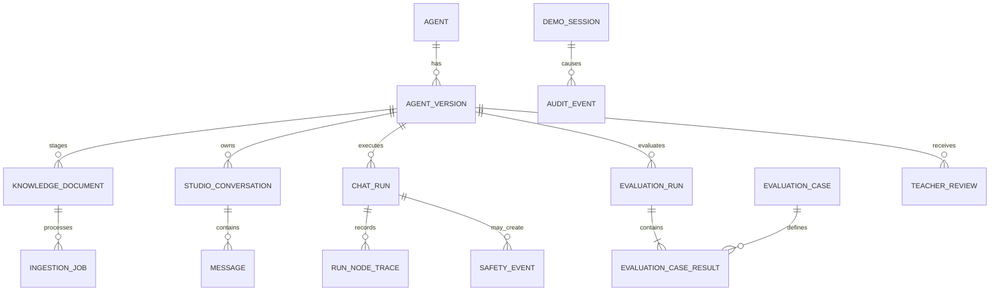

# Data Model

## 1. Storage ownership

- SQLite owns transactional product state.
- ChromaDB owns vector embeddings and retrievable chunk text.
- The persistent file tree owns original uploaded documents.
- OpenAI is a processing provider, not the source of product state.

All SQLite IDs are opaque UUIDs. Timestamps are UTC ISO-8601 in API responses and timezone-aware in application code.

## 2. Entity relationship overview

## 3. SQLite tables

### `agents`

| Field | Notes |
|---|---|
| `id` | UUID primary key |
| `slug` | unique public-safe slug |
| `display_name` | current display label derived from active version |
| `current_draft_version_id` | nullable |
| `published_version_id` | nullable; only one active public version |
| `created_at`, `updated_at` | UTC |
| `deleted_at` | nullable soft-delete marker during cleanup |
| `is_fixed_sample` | reset-protected sample marker; false for ordinary Studio Agents |

### `agent_versions`

| Field | Notes |
|---|---|
| `id` | UUID primary key |
| `agent_id` | foreign key |
| `version_number` | positive integer, unique per agent |
| `state` | `DRAFT`, `IN_REVIEW`, `CHANGES_REQUESTED`, `APPROVED`, `PUBLISHED`, `WITHDRAWN` |
| `project_name` | required |
| `problem_to_solve` | required |
| `intended_users` | required |
| `audience_age` | `AGE_7_11` or `AGE_12_17` |
| `success_goal` | required |
| `welcome_message` | required |
| `tone` | `FRIENDLY`, `CURIOUS`, `COACH_LIKE` |
| `response_length` | `SHORT`, `BALANCED` |
| `custom_instructions` | optional, max 500 characters |
| `what_changed` | required for version 2+ |
| `why_changed` | required for version 2+ |
| `source_version_id` | nullable parent snapshot |
| `active_document_id` | nullable until Ready |
| `submitted_at`, `approved_at`, `published_at`, `withdrawn_at` | nullable UTC |
| `created_at`, `updated_at` | UTC |

A version is mutable only while `DRAFT`. Database service methods enforce state transitions; no generic update route may bypass them.

### `knowledge_documents`

| Field | Notes |
|---|---|
| `id` | UUID primary key |
| `version_id` | foreign key |
| `original_filename` | sanitized basename |
| `media_type` | allowlisted MIME |
| `extension` | `pdf`, `txt`, `md` |
| `byte_size` | validated maximum 15 MB |
| `sha256` | lowercase hex |
| `storage_path` | server path, never returned publicly |
| `status` | ingestion status |
| `page_count` | nullable for non-PDF |
| `chunk_count` | set when Ready |
| `embedding_model` | model ID used |
| `error_code` | stable nullable code |
| `is_active` | one Ready active document per Draft version |
| `created_at`, `ready_at`, `retired_at` | UTC |

### `ingestion_jobs`

| Field | Notes |
|---|---|
| `id` | UUID |
| `document_id` | foreign key |
| `state` | `UPLOADED`, `EXTRACTING`, `CHUNKING`, `EMBEDDING`, `READY`, `FAILED` |
| `attempt` | incremented by explicit retry |
| `progress_completed`, `progress_total` | real batch counts where known |
| `started_at`, `heartbeat_at`, `finished_at` | UTC |
| `error_code`, `safe_error_message` | nullable |

### `studio_conversations`

- `id`, `version_id`, `created_at`, `updated_at`, `expires_at`.
- Exists only for protected Studio use.
- Public visitor conversations are not stored.

### `messages`

- `id`, `conversation_id`, `run_id`, `role`, `content`, `created_at`.
- Stores only allowed Studio messages and final validated outputs.
- PII-blocked raw content, raw unsafe output, and raw invalid output are forbidden.
- Assistant message citations are normalized in a separate `message_citations` table or a validated JSON column selected in M1; the choice must not alter the API shape.

### `chat_runs`

| Field | Notes |
|---|---|
| `id` | opaque UUID |
| `version_id` | foreign key |
| `conversation_id` | nullable for public runs |
| `surface` | `STUDIO`, `PUBLIC`, `EVALUATION` |
| `phase` | documented runtime phase |
| `result_type` | `ANSWERED`, `BLOCKED`, `GUIDED`, `REFUSED`, `FAILED` |
| `input_message_id`, `output_message_id` | nullable; public runs do not link content |
| `input_fingerprint` | keyed hash for diagnostics, never raw PII |
| `online_model`, `moderation_model`, `embedding_model` | effective IDs |
| `input_tokens`, `output_tokens`, `reasoning_tokens` | provider usage where available |
| `estimated_cost_usd` | decimal estimate, not billing authority |
| `retrieval_ms`, `provider_ms`, `total_ms` | timing |
| `error_code`, `retry_count` | nullable/zero |
| `created_at`, `finished_at`, `expires_at` | UTC |

For public runs, transient answer content may exist only in process memory and the short-lived API result cache. The database stores no full prompt or response.

### `run_node_traces`

- `id`, `run_id`, `node_name`, `sequence`, `status`, `started_at`, `finished_at`, `duration_ms`.
- `safe_summary_json` contains allowlisted fields only.
- Retrieval node summary may include chunk IDs, pages, ranks, and scores.
- It must not include hidden prompts, secrets, raw blocked PII, or raw unsafe model output.

### `safety_events`

- `id`, `run_id`, `version_id`, `category`, `action`, `detector`, `safe_summary`, `created_at`.
- Categories include PII, homework, injection, moderation category, output validation, and knowledge boundary.
- `safe_summary` is a fixed category description, not user text.

### `evaluation_cases`

- `id`, stable `case_key`, category, sanitized prompt, audience mode, expected behavior, rubric version, enabled flag.
- Seeded idempotently.
- Exact knowledge questions and evidence references are finalized from the unchanged NOAA document in M5.
- Users cannot modify cases through the application.

### `evaluation_runs`

| Field | Notes |
|---|---|
| `id` | UUID |
| `version_id` | evaluated immutable version |
| `state` | `QUEUED`, `RUNNING`, `COMPLETED`, `FAILED` |
| `suite_version` | fixed suite identity |
| `online_model`, `judge_model`, `embedding_model`, `moderation_model` | effective IDs |
| `total_cases`, `completed_cases`, `passed_cases`, `failed_cases`, `error_cases` | persisted counters |
| metric fields | final normalized metrics |
| `release_eligible` | server-computed boolean |
| `started_at`, `finished_at`, `timeout_at` | UTC |

### `evaluation_case_results`

- `id`, `evaluation_run_id`, `evaluation_case_id`, `state`, `pass`, `blocking`.
- Stores runtime `run_id`, deterministic check results, retrieved evidence IDs, citation result, Judge structured scores/rationale, latency, tokens, and safe error code.
- Results are append-only within a completed run.

### `teacher_reviews`

- `id`, `version_id`, `evaluation_run_id`, nullable acting `session_id`, `decision`, `feedback`, `created_at`.
- Decisions: `REQUEST_CHANGES`, `APPROVE`, `PUBLISH`, `WITHDRAW`.
- Feedback is required for Request changes.
- Approval references one completed, release-eligible evaluation run.

### `demo_sessions`

- `id`, `token_hash`, `csrf_hash`, `role`, `created_at`, `expires_at`, `last_seen_at`, `revoked_at`.
- No access code or raw session token is stored.

### `rate_limit_buckets`

- keyed subject hash, scope, window start/end, count.
- Subjects are keyed hashes of IP or session ID.
- Raw IP is never stored.

### `audit_events`

- records high-value state transitions and admin reset without secret or content payloads.
- includes actor type, action, target IDs, result, timestamp.

### `maintenance_state`

- records the last retention cleanup and schema/seed maintenance checkpoints.

## 4. Chroma documents

Chroma owns:

- stable chunk ID
- normalized chunk text
- embedding vector
- allowlisted metadata defined in `docs/ARCHITECTURE.md`

It does not own version lifecycle or active-document authority. SQLite is authoritative for whether a document may be queried.

## 5. Lifecycle invariants

- An agent has at most one current Draft and one published version.
- A version has at most one active Ready document.
- A submitted version cannot change configuration or document.
- An evaluation run targets exactly one immutable version.
- An approval references a completed release-eligible evaluation run for the same version.
- Publication targets an Approved version.
- Public retrieval always uses `agents.published_version_id` and that version's active Ready document.
- New publication changes the pointer transactionally; it does not mutate the old version.

## 6. Deletion and retention

### Studio content

- Normal Studio conversations and associated run content expire after 30 days.
- Startup and the first request after a 24-hour maintenance interval trigger cleanup.
- Evaluation evidence remains while its agent exists.

### Public content

- Full public prompts and answers are not persisted.
- Sanitized usage, rate limit, and safety metadata may be retained for 30 days.

### Agent deletion/reset

1. Mark the target deleted or reset-in-progress in SQLite.
2. Make it unavailable to new requests.
3. Delete related Chroma chunks by document/version metadata.
4. Remove target upload directories using resolved, validated paths under `DATA_DIR` only.
5. Cascade product rows according to the reset scope.
6. Record a sanitized audit event.

The fixed published sample is excluded from workspace reset. A published knowledge file cannot be deleted through ordinary Draft operations.

## 7. Migration rules

- All schema changes use Alembic from M1 onward.
- Migrations must succeed from an empty database and from the prior accepted module schema.
- Seed data is idempotent and separate from migrations when it includes product examples.
- No destructive migration runs automatically without a documented backup/recovery plan.
- Chroma metadata schema changes require an explicit re-index strategy and decision-log entry.
